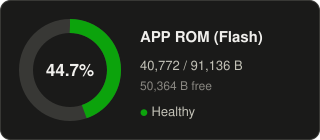
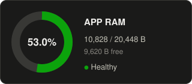
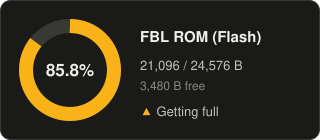
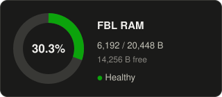
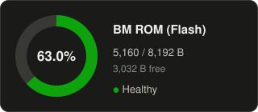

# STM32_RF_HUB

[:page_with_curl:](https://marks100org.github.io/STM32_test_bed/) 

## Memory usage

High-level ROM/RAM usage per image, written by the memory stats step of each build (memory_analyser_stm32). ROM is flash; all images share the same 20 KB of RAM.

<!-- MEMORY:APP:START -->
### APP

_Built 2026-11-15 from `APP.map`_

| Region | Used | Free | Used % |
|---|---:|---:|---:|
| ROM (Flash) | 40,012 B | 51,124 B | 43.9% |
| RAM | 10,824 B | 9,624 B | 52.9% |

  
  

<!-- MEMORY:APP:END -->

<!-- MEMORY:FBL:START -->
### FBL

_Built 2026-11-15 from `FBL.map`_

| Region | Used | Free | Used % |
|---|---:|---:|---:|
| ROM (Flash) | 21,088 B | 3,488 B | 85.8% |
| RAM | 6,176 B | 14,272 B | 30.2% |

  
  

<!-- MEMORY:FBL:END -->

<!-- MEMORY:BM:START -->
### BM

_Built 2026-11-15 from `BM.map`_

| Region | Used | Free | Used % |
|---|---:|---:|---:|
| ROM (Flash) | 5,176 B | 3,016 B | 63.2% |
| RAM | 1,088 B | 19,360 B | 5.3% |

  
  

<!-- MEMORY:BM:END -->
